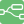
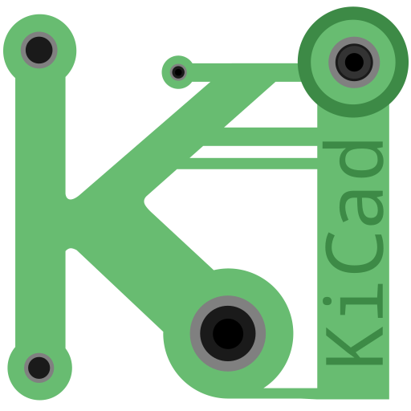

### Hi there, I'm Tahmid 👋

## Nuclear Engineer

- 🔭 I am currently working on [Osmocom GUI][osmo-gui]!
- 🌱 I’m currently learning Flutter
- 👯 I’m looking for R&D opportunities in nuclear safety and security
- 🥅 2022 Goals: Contribute more to Open Source projects
- ⚡ Fun fact: I love music and playing guitar

### Connect with me:

[][twitter]
[][youtube]
[ ][website]
[][linkedin]
[][instagram]
[][researchgate]

### Languages and Tools:

[ ][html]
[][css]
[][javascript]
[][python]
[][c++]
[][dart]
[][matlab]
[][powershell]
[][vscode]
[][azure]
[][postgresql]
[][node-red]
[][kicad]

[website]: https://ahnaf-tahmid.blogspot.com
[osmo-gui]: https://github.com/ahnaf-tahmid-chowdhury/osmo-gui
[twitter]: https://twitter.com/tahmid__
[youtube]: https://www.youtube.com/channel/UC1PqPjoQIsjNKmiiALeXYnw
[instagram]: https://instagram.com/_.ahnaf_tahmid._
[linkedin]: https://linkedin.com/in/ahnaf-tahmid-
[researchgate]: https://www.researchgate.net/profile/Ahnaf-Tahmid-Chowdhury
[html]: https://en.wikipedia.org/wiki/HTML
[css]: https://en.wikipedia.org/wiki/CSS
[javascript]: https://en.wikipedia.org/wiki/JavaScript
[python]: https://www.python.org/
[c++]: https://en.wikipedia.org/wiki/C%2B%2B
[dart]: https://dart.dev/
[powershell]: https://docs.microsoft.com/en-us/powershell/
[matlab]: https://www.mathworks.com/products/matlab.html
[node-red]: https://nodered.org/
[postgresql]: https://www.postgresql.org/
[kicad]: https://www.kicad.org/
[azure]: https://azure.microsoft.com/en-us/
[vscode]: https://code.visualstudio.com/
